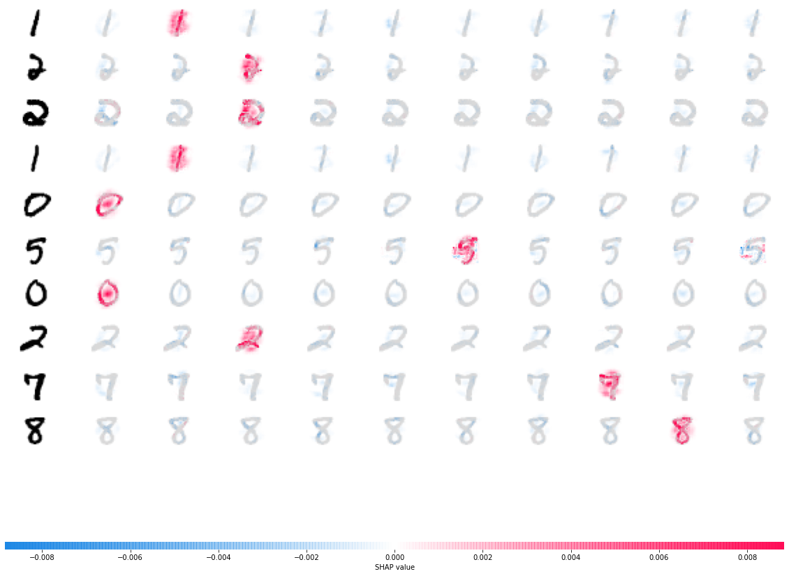
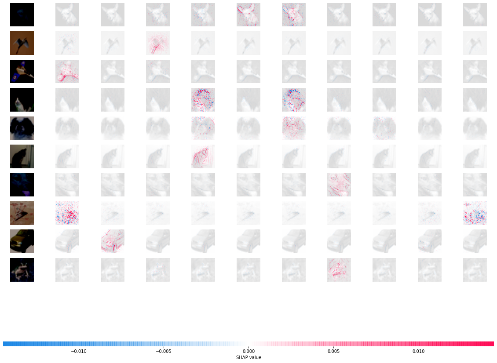

# Explaining CNN Image Classifiers with SHAP (MNIST and CIFAR-10)

Group project on model interpretability (Kernel SHAP and related methods) for the Statistical Machine Learning course, Sharif University of Technology (2021).

Deep image classifiers are accurate but hard to trust without knowing *which pixels* drive a prediction. This project trains CNN classifiers on MNIST and CIFAR-10, explains their predictions with **SHAP** (SHapley Additive exPlanations), and runs a simple **perturbation test** to check whether the pixels SHAP highlights really matter to the model.

## What's inside

1. **Classifiers**
   - A CNN on MNIST and a deeper CNN on CIFAR-10 in **TensorFlow/Keras**.
   - ResNet-based classifiers for both datasets in **PyTorch Lightning**, evaluated with scikit-learn's `classification_report`.
2. **Explanations.** Per-pixel attributions computed with the `shap` library's **DeepExplainer** (Deep SHAP, using 1,000 training images as the background set) and plotted with `shap.image_plot`: red pixels push the model toward a class, blue pixels push it away.
3. **Perturbation test.** For each explained image, pixels are ranked by their SHAP value and the top-ranked ~20% are overwritten (with the image's mean intensity on MNIST, and with the attribution values on CIFAR-10). The model is then re-evaluated on the modified images. If accuracy drops sharply, the explanation found pixels the model actually relies on.

## Example explanations

**MNIST.** Each row is one test digit; each column shows the attribution map for one class (0–9).



**CIFAR-10**



## Perturbation test (10 test images per dataset)

| Dataset | Accuracy on original images | Accuracy after replacing top-ranked pixels |
|---|---|---|
| MNIST | 100% | 70% |
| CIFAR-10 | 90% | 30% |

These numbers come from 10 test images per dataset, so they are illustrative rather than statistically meaningful. They do show the expected behaviour: overwriting the pixels SHAP ranks as most important clearly hurts the model's accuracy.

## Repository structure

```
notebooks/
  01_shap_mnist_cifar10_keras.ipynb            # Keras CNNs, SHAP explanations, perturbation test
  02_pytorch_lightning_resnet_classifiers.ipynb # ResNet classifiers in PyTorch Lightning
images/                                         # figures used in this README
requirements.txt
```

The notebooks were written for Google Colab (2021). Some cells load saved models from Google Drive and use TensorFlow 2.3 / Keras 2.4 / SHAP 0.36; newer versions may need small changes.

## Tech

Python, TensorFlow, Keras, PyTorch, PyTorch Lightning, SHAP, scikit-learn, NumPy, OpenCV, Matplotlib.

## Author

Bahar Jahani · [LinkedIn](https://www.linkedin.com/in/bahar-jahani-a711a81b3)
